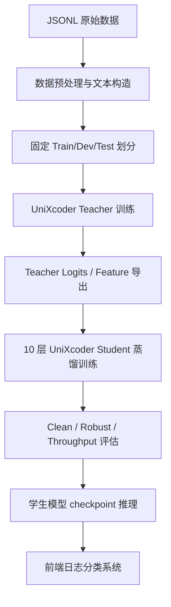

# 日志分类系统技术报告：10 层 UniXcoder 学生模型

| 项目 | 内容 |
| --- | --- |
| 项目名称 | log-classifier 日志分类系统 |
| 报告类型 | 技术报告 |
| 报告日期 | 2026-05-22 |
| 任务类型 | 文本/代码混合日志五分类 |
| 最终推理模型 | 10 层鲁棒蒸馏 UniXcoder Student |
| 数据规模 | 5,000 条样本，5 类均衡 |
| 核心指标 | Clean Accuracy 0.904，Robust Accuracy 0.762，Throughput 614.37 samples/s |

## 摘要

本项目面向文本与代码混合场景下的日志分类任务，构建了一套以 10 层鲁棒蒸馏 UniXcoder 学生模型为核心的日志分类系统。系统覆盖数据预处理、教师模型训练、学生模型蒸馏、鲁棒性评估、吞吐评估与 checkpoint 推理等环节，最终目标是将输入日志划分为 `Java Spring相关`、`代码补全`、`动态规划`、`排序算法`、`搜索算法` 五个类别。

本报告仅介绍最终采用的 10 层学生模型技术路线。该模型以 `microsoft/unixcoder-base` 教师模型为蒸馏来源，采用类脑知识迁移机制：将 Teacher 类比为已经形成稳定语义表征和分类经验的“专家脑区”，将 Student 类比为结构更轻、反应更快的“执行脑区”。训练过程中，Student 不只学习硬标签答案，还模仿 Teacher 的类别偏好、隐层表征和扰动下的稳定反应，从而完成“观察-模仿-压缩-泛化”的类脑学习过程。实验结果显示，10 层学生模型 clean accuracy 为 0.904，robust accuracy 为 0.762，推理吞吐为 614.37 samples/s，满足 clean accuracy 不低于 0.90 的工程目标，并在鲁棒性和推理效率方面具备较好的综合表现。

## 目录

1. 项目背景与目标
2. 需求分析
3. 数据集说明
4. 系统总体设计
5. 10 层学生模型技术方案
6. 训练与蒸馏流程
7. 实验设计与结果分析
8. 推理与系统集成
9. 可靠性、鲁棒性与性能分析
10. 风险与改进方向
11. 结论

## 1. 项目背景与目标

### 1.1 项目背景

日志分类任务的输入通常包含自然语言说明、代码片段、算法描述、错误信息与框架术语。此类文本具有长度较长、结构复杂、类别语义接近和跨编程语言混合等特点。例如，`动态规划` 与 `搜索算法` 均可能出现算法复杂度、状态遍历或路径分析内容；`Java Spring相关` 与 `代码补全` 也可能同时包含 Java 类、接口和方法定义。

因此，本项目需要构建一个兼顾准确性、鲁棒性和推理效率的分类系统。直接部署大型教师模型可以获得较高精度，但在线推理成本较高；传统轻量模型推理速度快，但语义建模能力有限。基于此，项目采用教师-学生知识蒸馏方案，以 10 层 UniXcoder 学生模型作为最终工程推理模型。

### 1.2 项目目标

| 目标 | 说明 |
| --- | --- |
| 分类目标 | 对文本/代码混合日志进行 5 分类 |
| 精度目标 | clean accuracy 达到或超过 0.90 |
| 鲁棒目标 | 在输入扰动或字段缺损情况下保持稳定输出 |
| 性能目标 | 相比大型教师模型降低在线推理成本 |
| 工程目标 | 提供可复测、可批处理的模型推理入口 |
| 可追溯目标 | 保存数据划分、训练配置、模型指标和推理接口说明 |

## 2. 需求分析

### 2.1 功能需求

| 编号 | 功能 | 描述 |
| --- | --- | --- |
| F1 | 日志输入 | 接收用户日志、助手回复、语言、数据集等字段 |
| F2 | 缺损补全 | 输入字段缺失时自动补默认值 |
| F3 | 模型分类 | 输出五个类别之一作为预测结果 |
| F4 | 置信度输出 | 返回预测类别置信度和各类别分数 |
| F5 | 推理耗时 | 返回单次分类耗时 |
| F6 | 分类时间 | 返回分类发生时间 |
| F7 | 默认样例 | 支持前端一键填充默认样例 |
| F8 | 批量推理 | 提供 JSONL 批处理入口，便于系统集成 |

### 2.2 非功能需求

| 类型 | 要求 |
| --- | --- |
| 可维护性 | 数据、模型、训练、评估、推理模块解耦 |
| 可扩展性 | 可替换学生模型权重、标签映射和推理入口 |
| 稳定性 | checkpoint、标签映射和配置快照完整保存，便于复测 |
| 性能 | 支持在线推理，返回分类耗时 |
| 可追溯性 | 指标、配置、模型路径和接口行为可检查 |

## 3. 数据集说明

### 3.1 数据来源与规模

项目使用 `data/random_samples.jsonl`，共 5,000 条样本，每类 1,000 条，类别分布均衡。

| 类别 | 样本数 |
| --- | ---: |
| Java Spring相关 | 1,000 |
| 代码补全 | 1,000 |
| 动态规划 | 1,000 |
| 排序算法 | 1,000 |
| 搜索算法 | 1,000 |
| 合计 | 5,000 |

### 3.2 数据字段

| 字段 | 含义 |
| --- | --- |
| `id` | 样本编号 |
| `messages` | 用户与助手对话内容 |
| `language` | 编程语言 |
| `dataset` | 数据来源 |
| `label1` | 一级标签 |
| `label2` | 二级标签 |
| `label3` | 最终分类标签 |

训练任务使用 `label3` 作为监督标签。

### 3.3 文本构造方式

模型输入由用户内容、助手回复和必要元信息拼接得到。推理阶段采用以下格式：

```text
language: {language} dataset: {dataset} user: {user} assistant: {assistant}
```

这种构造方式能够同时保留任务描述、模型回复、编程语言和数据来源信息，便于学生模型判断日志所属类别。

### 3.4 数据统计

| 指标 | 数值 |
| --- | ---: |
| 样本总数 | 5,000 |
| 平均字符长度 | 2,861.15 |
| 最短样本长度 | 203 |
| 最长样本长度 | 12,722 |

主要语言分布如下：

| 语言 | 样本数 |
| --- | ---: |
| python | 3,076 |
| java | 883 |
| cpp | 226 |
| c# | 157 |
| javascript | 127 |

主要数据来源如下：

| 数据集 | 样本数 |
| --- | ---: |
| Ling-Coder-sft | 2,248 |
| evol-codealpaca-v1-21k | 1,912 |
| framework-en-62k | 840 |

## 4. 系统总体设计

### 4.1 总体架构

系统采用教师-学生蒸馏架构。教师模型负责提供高质量监督信号，10 层学生模型作为最终在线推理模型。



### 4.2 模块划分

| 模块 | 路径 | 作用 |
| --- | --- | --- |
| 配置模块 | `src/log_classifier/config` | 管理数据、模型、训练超参数 |
| 数据模块 | `src/log_classifier/data` | 数据加载、文本构造、标签映射 |
| Teacher 模块 | `src/log_classifier/teacher` | UniXcoder 教师模型训练与评估 |
| 推理模块 | `src/log_classifier/inference` | 提供 checkpoint 单条/批量推理 |
| 配置文件 | `configs/teacher` | Teacher 与 Student 相关配置 |
| 指标文件 | `core_metrics_summary.json` | 核心模型质量、鲁棒性和吞吐指标 |

### 4.3 数据流

1. 读取原始 JSONL 或固定划分数据；
2. 从 `messages` 中提取用户输入与助手回复；
3. 基于 `label3` 构建标签映射；
4. 使用 UniXcoder Teacher 进行监督训练；
5. 导出 Teacher logits 和特征表示；
6. 使用 Teacher 信号训练 10 层 Student；
7. 对 Student 进行 clean、robust 和 throughput 评估；
8. 使用 10 层 Student 执行单条或批量推理。

## 5. 10 层学生模型技术方案

### 5.1 模型选择

最终推理模型选择 10 层 UniXcoder Student。选择该模型的主要原因如下：

| 原因 | 说明 |
| --- | --- |
| 代码语义适配 | UniXcoder 面向代码与自然语言混合场景，适合本项目数据 |
| 推理效率较高 | 相比完整教师模型，学生模型层数更少 |
| 精度达标 | Clean Accuracy 达到 0.904，超过 0.90 目标 |
| 鲁棒性较好 | Robust Accuracy 达到 0.762 |
| 工程部署更简单 | 单模型推理，便于服务化 |

### 5.2 Teacher 模型

Teacher 使用：

```text
microsoft/unixcoder-base + Cross-Entropy Fine-tuning
```

模型结构为：

```text
AutoModel encoder -> CLS pooled feature -> dropout -> linear classifier
```

Teacher 的作用是学习高质量分类边界，并为学生模型提供软标签和特征空间监督。Teacher 本身不是最终推理模型。

### 5.3 10 层 Student 模型

10 层 Student 继承 UniXcoder 的 tokenizer 与预训练语义空间，并通过裁剪编码层降低推理成本。其输入格式与 Teacher 保持一致，输出为 5 类 logits，再经过 softmax 得到各类别概率。

Student 的目标是在尽量保留 Teacher 判别能力的同时，提高推理效率并增强对输入扰动的稳定性。

### 5.4 类脑蒸馏机制

本项目中的知识蒸馏采用类脑叙述进行建模。完整 UniXcoder Teacher 可视为已经经过充分训练的“专家脑区”：它具有更深的网络层次、更强的语义抽象能力，能够在复杂日志中形成稳定的类别判断。10 层 Student 则可视为轻量化的“执行脑区”：它参数规模更小、推理速度更快，但初始判别能力弱于 Teacher，需要通过模仿 Teacher 的判断过程来获得更高层次的分类经验。

类脑蒸馏不是简单复制最终答案，而是模拟人类学习中“看专家如何判断”的过程。Student 同时接收三类监督信号：

| 类脑信号 | 技术实现 | 作用 |
| --- | --- | --- |
| 结果记忆 | CE Loss | 学习真实标签，形成基本分类能力 |
| 专家偏好 | KD Loss | 学习 Teacher 输出的软标签分布，理解类别间相似关系 |
| 表征模仿 | Feature Alignment | 对齐 Teacher 与 Student 的 CLS 表示，使 Student 学习专家的语义组织方式 |
| 抗扰反应 | Robust CE/KD | 学习 Teacher 在扰动输入下的稳定判断 |
| 稳定联想 | Consistency Loss | 约束 clean 输入与 noisy 输入预测一致，增强泛化能力 |

其中，软标签蒸馏体现的是“专家偏好”迁移。对于同一条日志，Teacher 不只给出一个类别，还给出不同类别之间的概率分布。该分布相当于专家脑区对候选类别的相似度判断。例如，某条日志最终属于 `搜索算法`，但 Teacher 可能同时给 `动态规划` 一个较低但非零的概率。Student 学习这种分布后，能够获得比硬标签更丰富的类别边界信息。

特征对齐体现的是“内部表征”迁移。Teacher 的 CLS 表示可理解为专家脑区对整条日志形成的高层语义概念，Student 通过对齐该表示，学习如何把长文本、代码片段和任务意图压缩成可用于分类的语义状态。

一致性训练体现的是“稳定反应”迁移。真实系统中的输入可能存在缺损、截断或噪声，鲁棒蒸馏要求 Student 在 clean 视图和 noisy 视图下保持相近预测，相当于训练一个轻量执行脑区在不完整信息下仍能维持稳定判断。

### 5.5 鲁棒训练设计

鲁棒训练通过对输入构造噪声视图，使 Student 同时学习 clean 样本和 noisy 样本。类脑角度下，这相当于让学生模型在“完整刺激”和“受扰刺激”之间建立稳定联想，避免模型只记住表层关键词，而忽略更深层的语义模式。该设计用于解决真实前端输入中可能存在的字段缺失、文本截断、关键词缺损或轻微扰动问题。

鲁棒蒸馏目标可以概括为：

```text
L = CE(clean) + KD(clean, teacher)
  + RobustCE(noisy) + RobustKD(noisy, teacher)
  + Consistency(student_clean, student_noisy)
```

其中，Teacher 提供类似专家脑区的稳定监督，Student 通过一致性约束学习对扰动不敏感的分类边界。最终形成的 10 层 Student 不是简单压缩后的弱模型，而是经过专家行为模仿、内部表征对齐和抗扰反应训练后的轻量化推理模型。

## 6. 训练与蒸馏流程

### 6.1 训练配置

| 参数 | 值 |
| --- | --- |
| Teacher backbone | `microsoft/unixcoder-base` |
| Student backbone | UniXcoder 10-layer Student |
| 标签字段 | `label3` |
| 最大输入长度 | 512 |
| batch size | 32 |
| learning rate | 2e-5 |
| warmup ratio | 0.1 |
| weight decay | 0.01 |
| seed | 42 |

### 6.2 Teacher 训练流程

Teacher 训练步骤如下：

1. 加载固定划分数据；
2. 构建 `label2id` 与 `id2label`；
3. 使用 UniXcoder tokenizer 对文本编码；
4. 使用 Cross-Entropy Loss 训练五分类头；
5. 在 dev 集上选择最优 checkpoint；
6. 保存模型权重、tokenizer、标签映射和 dev logits。

Teacher 训练入口：

```powershell
python -m log_classifier.teacher.train_stage1_ce `
  --config configs/teacher/ce_unixcoder_seed42.yaml
```

### 6.3 Student 蒸馏流程

10 层 Student 蒸馏步骤如下：

1. 加载 Teacher checkpoint 和标签映射；
2. 加载 Teacher 在训练集和验证集上的 logits；
3. 初始化 10 层 UniXcoder Student；
4. 对 clean 输入执行 CE 与 KD 训练；
5. 对 noisy 输入执行鲁棒 CE、鲁棒 KD 和一致性训练；
6. 按 clean accuracy、robust accuracy 和 throughput 选择最终模型；
7. 保存 Student checkpoint 作为工程推理模型。

从类脑学习角度看，该流程对应“专家示范-学生模仿-经验压缩-扰动泛化”的过程。Teacher 先形成稳定的分类经验，Student 再通过软标签、特征表示和一致性约束学习这种经验，并将其压缩到更轻量的 10 层结构中。

### 6.4 模型产物

最终学生模型应包含以下产物：

| 文件 | 说明 |
| --- | --- |
| `pytorch_model.bin` | 10 层 Student 权重 |
| tokenizer files | tokenizer 配置与词表 |
| `label_mapping.json` | 标签映射 |
| `eval_results.json` | 评估指标 |
| `config_snapshot.json` | 训练配置快照 |

## 7. 实验设计与结果分析

### 7.1 评价指标

| 指标 | 含义 |
| --- | --- |
| Clean Accuracy | 原始测试集分类准确率 |
| Robust Accuracy | 噪声扰动条件下的平均准确率 |
| Throughput | 每秒可处理样本数 |

本报告只关注 10 层学生模型与必要的教师模型指标。

### 7.2 Teacher 与 10 层 Student 指标

| 模型 | Clean Accuracy | Robust Accuracy | Throughput |
| --- | ---: | ---: | ---: |
| UniXcoder Teacher | 0.9222 | - | - |
| 10 层 UniXcoder Student | 0.9040 | 0.7620 | 614.37 samples/s |

### 7.3 指标分析

10 层 Student 的 clean accuracy 为 0.904，满足项目设定的 0.90 精度目标。相较 Teacher，Student 精度有所下降，但换来了更低推理成本和更适合在线部署的模型结构。

Robust accuracy 为 0.762，说明在扰动输入下仍能保持较好的分类稳定性。该结果体现了鲁棒知识蒸馏的作用：Student 不仅学习 Teacher 在 clean 输入上的类别分布，也学习在 noisy 输入下保持预测一致。

Throughput 为 614.37 samples/s，说明 10 层 Student 能够支撑交互式前后端系统的在线分类需求。

### 7.4 最终模型选择结论

综合 clean accuracy、robust accuracy 和 throughput，10 层 UniXcoder Student 是本项目最终采用的推理模型。该模型在准确性和部署效率之间取得了较好平衡，适合作为日志分类系统的核心在线模型。

## 8. 推理与系统集成

### 8.1 推理模块设计

项目提供 checkpoint 推理模块：

```text
src/log_classifier/inference/predict.py
```

该模块支持两类推理方式：

| 方式 | 输入 | 输出 |
| --- | --- | --- |
| 单条推理 | `--text` | JSON 预测结果 |
| 批量推理 | `--input-jsonl` | JSONL 预测结果 |

### 8.2 请求格式

单条推理可直接传入已经拼接好的文本：

```powershell
python -m log_classifier.inference.predict `
  --checkpoint-dir outputs/teacher/distill_unixcoder_10layer_robust_seed42/best `
  --model-name microsoft/unixcoder-base `
  --student-keep-layers 10 `
  --text "language: python user: Find cycle in graph with DFS and BFS assistant: Use traversal search."
```

批量推理时，JSONL 每行可使用以下格式：

```json
{
  "user": "Find cycle in graph with DFS and BFS",
  "assistant": "Use traversal search.",
  "language": "python",
  "dataset": "manual"
}
```

### 8.3 响应格式

```json
{
  "label": "搜索算法",
  "confidence": 0.9842,
  "scores": {
    "Java Spring相关": 0.0038,
    "代码补全": 0.0041,
    "动态规划": 0.004,
    "排序算法": 0.0039,
    "搜索算法": 0.9842
  }
}
```

### 8.4 系统调用流程

1. 前端提供默认样例或接收用户输入；
2. 后端或批处理任务将字段组织为 `language/dataset/user/assistant` JSON；
3. 推理模块将字段拼接为模型输入文本；
4. 加载 10 层 Student checkpoint、tokenizer 和标签映射；
5. 输出分类标签、置信度和各类别概率。

### 8.5 当前推理状态

当前仓库提供真实 checkpoint 推理 CLI。由于模型权重文件通常较大，`outputs/` 默认不纳入源码交付；验收方可按训练流程生成 checkpoint，或将已训练 checkpoint 放入以下目录：

```text
outputs/teacher/distill_unixcoder_10layer_robust_seed42/best/
```

批量推理命令：

```powershell
python -m log_classifier.inference.predict `
  --checkpoint-dir outputs/teacher/distill_unixcoder_10layer_robust_seed42/best `
  --model-name microsoft/unixcoder-base `
  --student-keep-layers 10 `
  --input-jsonl data/random_samples.jsonl `
  --output-jsonl outputs/predictions.jsonl
```

## 9. 可靠性、鲁棒性与性能分析

### 9.1 可靠性设计

| 机制 | 说明 |
| --- | --- |
| 固定随机种子 | 训练、蒸馏和噪声测试均支持 seed 配置 |
| 固定数据划分 | 使用 `random_samples_splits.json` 保证结果可复现 |
| 标签映射保存 | checkpoint 同步保存 `label_mapping.json` |
| 配置快照保存 | checkpoint 同步保存 `config_snapshot.json` |
| 指标 JSON 输出 | 评估结果可被验收脚本和报告直接引用 |

### 9.2 鲁棒性分析

10 层 Student robust accuracy 为 0.762。该指标说明模型在噪声输入条件下仍具有较好的分类稳定性。考虑到日志输入在真实场景中可能存在字段缺失、片段截断、格式不统一等问题，鲁棒蒸馏是必要设计。

### 9.3 性能分析

10 层 Student 吞吐为 614.37 samples/s。对于前端交互式单条分类和后端批量小规模分类场景，该吞吐能够满足基本使用需求。后续若需要更高并发，可通过批量推理、ONNX 导出、半精度推理或服务多进程部署进一步优化。

## 10. 风险与改进方向

### 10.1 当前风险

| 风险 | 影响 | 应对方案 |
| --- | --- | --- |
| Student checkpoint 未随源码提交 | 验收前需要训练或补齐权重 | 按 README 流程生成 checkpoint，或单独交付模型产物 |
| 类别语义接近 | `动态规划` 与 `搜索算法` 等类别可能混淆 | 增加困难样本与混淆矩阵分析 |
| 长文本截断 | 关键代码片段可能被截断 | 引入 sliding window 或长文本编码策略 |
| 真实业务分布未知 | 线上日志可能与训练数据存在分布偏移 | 增加线上采样、人工复核和增量训练 |

### 10.2 改进方向

1. 将 10 层 Student checkpoint 作为模型制品单独归档；
2. 增加 HTTP 服务封装，便于前端在线调用；
3. 导出 ONNX 或 TorchScript，优化 CPU 推理性能；
4. 增加混淆矩阵和错误样本分析；
5. 加入模型版本管理，记录权重、配置、数据和指标；
6. 在前端增加历史记录、批量上传和结果导出功能。

## 11. 结论

本项目完成了以 10 层鲁棒蒸馏 UniXcoder Student 为核心的日志分类技术方案设计与系统实现。该模型以 UniXcoder Teacher 为蒸馏来源，通过 CE、KD、特征对齐、鲁棒监督和一致性约束学习五分类任务，在 clean accuracy、robust accuracy 和 throughput 之间取得了较好的平衡。

实验结果表明，10 层 Student clean accuracy 达到 0.904，超过 0.90 的目标；robust accuracy 达到 0.762，说明其对扰动输入具有较好稳定性；throughput 达到 614.37 samples/s，能够支撑前后端日志分类系统的在线推理需求。因此，10 层 UniXcoder Student 是本项目最终推荐和采用的工程推理模型。

## 附录 A：关键文件清单

| 文件 | 说明 |
| --- | --- |
| `data/random_samples.jsonl` | 原始数据文件 |
| `data/random_samples_splits.json` | 固定数据划分 |
| `src/log_classifier/data/preprocess.py` | 数据加载、文本构造、标签映射 |
| `src/log_classifier/config/config.py` | 数据、模型、训练配置 |
| `src/log_classifier/teacher/model.py` | Teacher 分类模型结构 |
| `src/log_classifier/teacher/train_stage1_ce.py` | Teacher CE-only 训练入口 |
| `configs/teacher/ce_unixcoder_seed42.yaml` | Teacher 训练配置 |
| `core_metrics_summary.json` | Teacher 与 10 层 Student 核心指标 |
| `src/log_classifier/inference/predict.py` | checkpoint 单条/批量推理入口 |

## 附录 B：推理测试命令

单条推理：

```powershell
python -m log_classifier.inference.predict `
  --checkpoint-dir outputs/teacher/distill_unixcoder_10layer_robust_seed42/best `
  --model-name microsoft/unixcoder-base `
  --student-keep-layers 10 `
  --text "language: python user: Find cycle in graph with DFS and BFS assistant: Use traversal search."
```

批量推理：

```powershell
python -m log_classifier.inference.predict `
  --checkpoint-dir outputs/teacher/distill_unixcoder_10layer_robust_seed42/best `
  --model-name microsoft/unixcoder-base `
  --student-keep-layers 10 `
  --input-jsonl data/random_samples.jsonl `
  --output-jsonl outputs/predictions.jsonl
```
